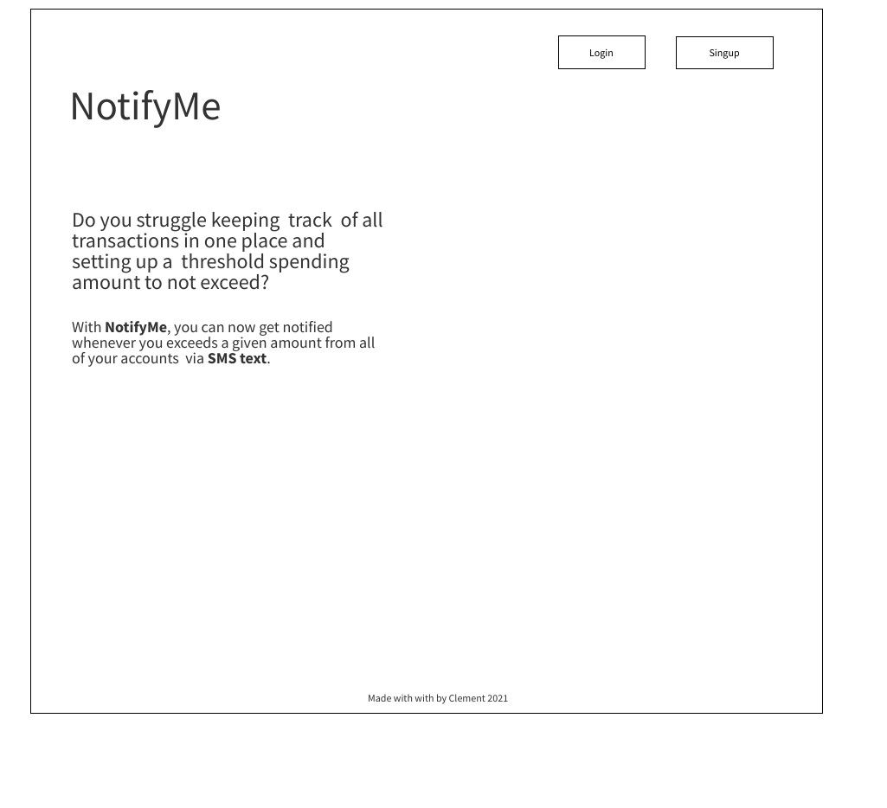
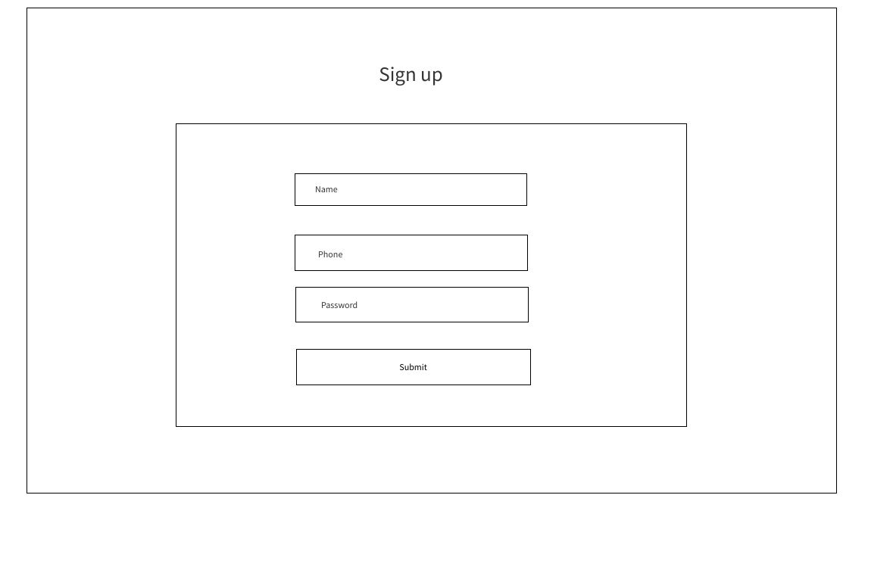
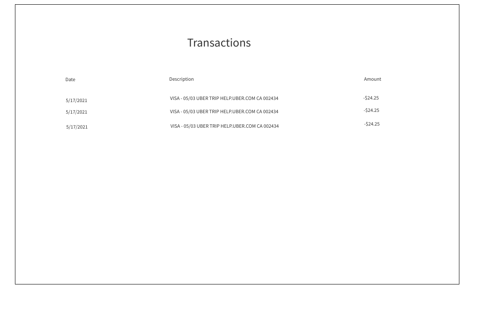
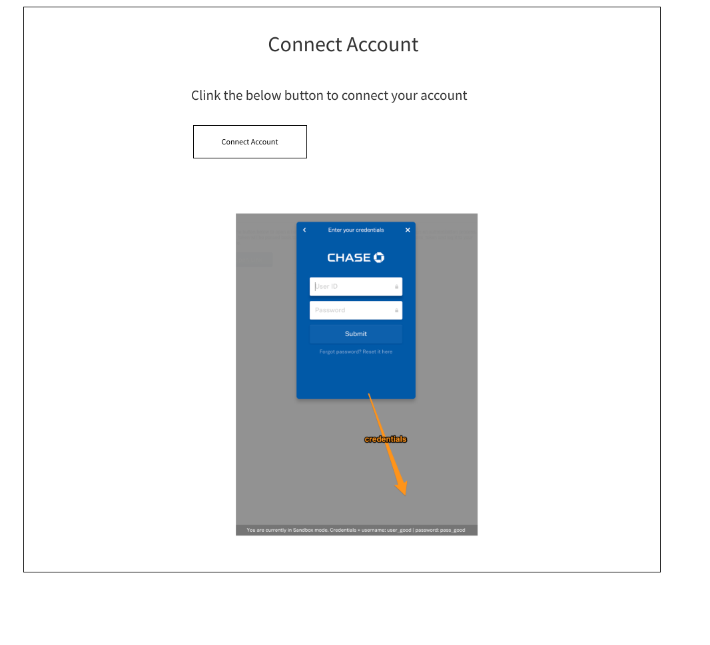
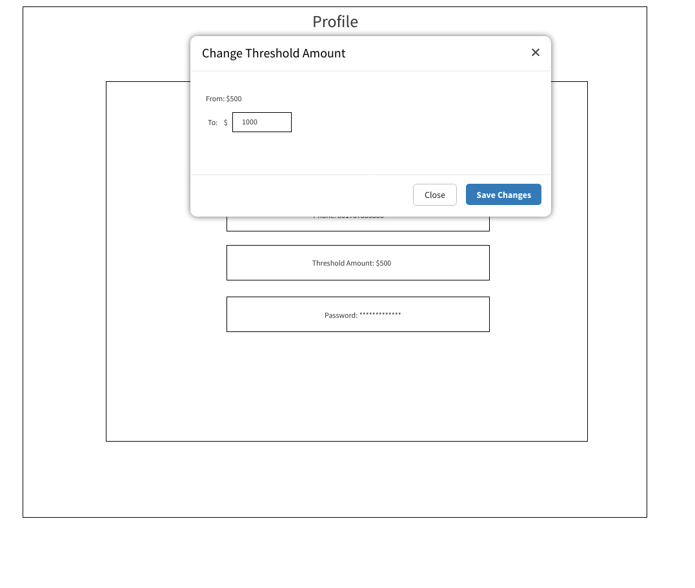
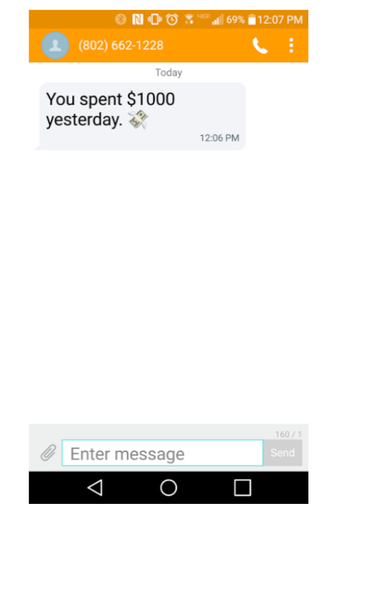
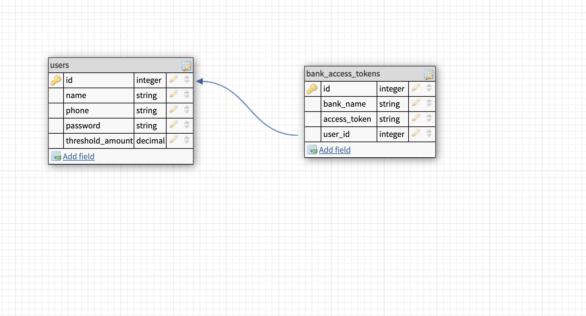

# notifyme_frontend

Notifyme is a personal finance helper that sends an SMS everytime a person spends over x amount daily accross all of his/her accounts using [Plaid](https://plaid.com/) payment API and [Twilio](https://www.twilio.com/) API for SMS.

## Wireframes

## User stories

1. When a user clicks sign up button, a form is displayed to submit the info and be redicted to the transactions page on success.

2. When a user clicks login button, a form is displayed to submit the info and be redicted to the transactions  page on success.

3. When a user clicks the My transactions button, a list of all the user's transactions across all accounts are displayed.

4. When a user clicks the link account button, he/she can choose which account to link to from the list.

5. When the user clicks the profile button, he/she can see the profile and may change the phone number of threshold spending amount.

## ERD

## MVP
1. Allow user registration
2. Allow user authentication
3. Allow user to link as many accounts as he/she wants.
4. Display user transactions accross different accounts.
5. Notifly the user via SMS when his/her spendings exceed X amount
6. Allow the user to set the threshold spending amount.

## Stretch Goals 
1. To save daily transactions that exceeded the threshold amount set by the user with highlighted on which that happened.

